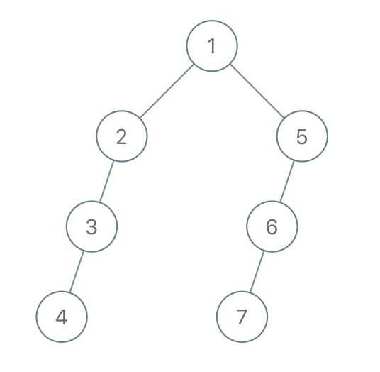
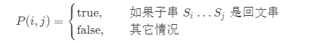
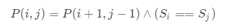
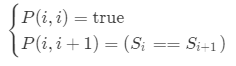

# Leetcode-Python-Algorithm
使用python刷leetcode

## **目录**

[TOC]


## 树

### 1.检查平衡性

**题目：**

实现一个函数，检查二叉树是否平衡。在这个问题中，平衡树的定义如下：任意一个节点，其两棵子树的高度差不超过 1。

示例 1:

```
给定二叉树 [3,9,20,null,null,15,7]
    3
   / \
  9  20
    /  \
   15   7
返回 true 。
```


示例 2:

```
给定二叉树 [1,2,2,3,3,null,null,4,4]
      1
     / \
    2   2
   / \
  3   3
 / \
4   4
返回 false 。
```

**思路：**

```
由题目想到可以通过分别检查每个节点左右子树的高度，如果两者高度只差大于1，那么它不是平衡的。而高度的计算则是一个递归问题，本题的解决思路便是在递归计算树高度的过程中判断树的平衡性。

二叉树的高度可以递归来计算：
1.如果输入的是空节点，那么返回高度值0
2.如果输入的是叶子节点，那么返回高度1
3.如果输入的是非叶子节点，那么分别计算左右子树的高度，选取其中最大者加1作为本节点的高度。
```

**解题代码：**

```
class TreeNode:
    def __init__(self, x):
        self.val = x
        self.left = None
        self.right = None

class Solution:
    isBalance = True
    def getTreeHeight(self, node):
        if node == None:
            return 0

        leftHeight = self.getTreeHeight(node.left)
        rightHeight =self.getTreeHeight(node.right)

        if abs(leftHeight - rightHeight) > 1:
            self.isBalance = False

        treeHeight = max(leftHeight,rightHeight) + 1

        return treeHeight


    def isBalanced(self, root: TreeNode) -> bool:

        self.getTreeHeight(root)

        return self.isBalance
```


### 2.合法二叉搜索树

**题目：**

实现一个函数，检查一棵二叉树是否为二叉搜索树。

```
示例 1:
输入:
    2
   / \
  1   3
输出: true
```

```
示例 2:
输入:
    5
   / \
  1   4
     / \
    3   6
输出: false
解释: 输入为: [5,1,4,null,null,3,6]。
     根节点的值为 5 ，但是其右子节点值为 4 。
```


**思路：**

```
二叉搜索树的性质：
任意节点的键值一定大于其左子树中的每一个节点的键值，并小于其右子树中的每一个节点的键值。
暴力破解法：
对每个节点，检查其值是否大于左子树的最大值，是否小于右子树的最小值
巧妙破解法：
观察其每个节点数值变化特点，满足中序遍历规律，采用中序遍历产生列表，若为递增，则是BST
```


**解题代码：**

利用性质破解：

```

# Definition for a binary tree node.
class TreeNode:
    def __init__(self, x):
        self.val = x
        self.left = None
        self.right = None


class Solution:
    nodeValueList = []
    isBST = True

    def inOrder(self, node):
        if node is None:
            return

        self.inOrder(node.left)

        node_value = node.val
        self.nodeValueList.append(node_value)

        self.inOrder(node.right)

    def isValidBST(self, root: TreeNode) -> bool:
        self.nodeValueList = []
        if root is None:
            return True
        if root.left is None and root.right is None:
            return True
        self.inOrder(root)

        for i in range(len(self.nodeValueList) - 1):
            if self.nodeValueList[i] >= self.nodeValueList[i + 1]:
                self.isBST = False
        return self.isBST
```

利用递归破解：

```
class Solution:
    def isValidBST(self, root: TreeNode) -> bool:
        
        def dfs(root, min_node, max_node):
            if not root: return True
            
            if min_node and root.val <= min_node.val: return False
            elif max_node and root.val >= max_node.val: return False
            left_flag = dfs(root.left, min_node, root)
            right_flag = dfs(root.right, root, max_node)
            
            return left_flag and right_flag
        
        return dfs(root, None, None)
```


### 3.后继者

**题目：**

设计一个算法，找出二叉搜索树中指定节点的“下一个”节点（也即中序后继）。

如果指定节点没有对应的“下一个”节点，则返回`null`。

示例 1:

```
输入: root = [2,1,3], p = 1

  2
 / \
1   3

输出: 2
```

示例 2:

```
输入: root = [5,3,6,2,4,null,null,1], p = 6

      5
     / \
    3   6
   / \
  2   4
 /   
1

输出: null
```

**思路：**

```
通过中序遍历求解。
找到当前节点为所求节点的值，设置flag=1，
当flag=1，说明上一节点已经找到，根据中序遍历顺序，当前节点就是所求节点
```

**解题代码：**

```
class TreeNode:
    def __init__(self, x):
        self.val = x
        self.left = None
        self.right = None

class Solution:
    def inorderSuccessor(self, root: TreeNode, p: TreeNode) -> TreeNode:
        if not root:return None
        stack = []
        cur = root
        flag = 0
        while stack or cur:
            if cur:
                stack.append(cur)
                cur = cur.left
            else:
                cur = stack.pop()
                if flag:#如果前节点已经找到，当前节点就是所求节点
                    return cur
                if cur.val == p.val:#判断当前节点是否是所求节点
                    flag = 1
                cur = cur.right
        return None
```


### 4.首个共同祖先

**题目：**

设计并实现一个算法，找出二叉树中某两个节点的第一个共同祖先。不得将其他的节点存储在另外的数据结构中。注意：这不一定是二叉搜索树。

例如，给定如下二叉树: root = [3,5,1,6,2,0,8,null,null,7,4]

```
    3
   / \
  5   1
 / \ / \
6  2 0  8
  / \
 7   4
```

示例1：

```
输入: root = [3,5,1,6,2,0,8,null,null,7,4], p = 5, q = 1
输入: 3
解释: 节点 5 和节点 1 的最近公共祖先是节点 3。
```

示例2：

```
输入: root = [3,5,1,6,2,0,8,null,null,7,4], p = 5, q = 4
输出: 5
解释: 节点 5 和节点 4 的最近公共祖先是节点 5。因为根据定义最近公共祖先节点可以为节点本身。
```

说明:

```
所有节点的值都是唯一的。
p、q 为不同节点且均存在于给定的二叉树中。
```

**思路：**

思路来自于leetcode解题方案：

```
分析：
	对于当前的根节点root
		1.若root为空，直接返回root，表示没有找到目标
		2.若root为p或q
			若左子树或右子树中含有另外一个目标节点，那么root就是最终答案，返回root
			否则，也应当返回root，表示找到了其中一个目标
		3.否则
            若左子树和右子树分别含有p、q中的一个，那么root就是最终答案，返回root
            否则
                若两子树中含有p或q中的一个，即返回那个节点，表示找到了其中一个目标
                否则返回nullptr，表示没有找到目标
整理：
	经过整理我们发现
        若root为p或q，无论子树是否含有另外一个目标，都应该返回root
        另外，当左右子树的均含有目标节点时，返回root，否则只需返回找到的目标节点或空指针


难点在于如何书写递归函数，不妨这样思考：
	假设我们从跟结点开始，采用 DFS 向下遍历，如果当前结点到达叶子结点下的空结点时，返回空；如果当前结点为 p 或 q 时，返回当前结点；
	这样，当我们令 left = self.lowestCommonAncestor(root.left, p, q) 时，如果在左子树中找到了 p 或 q，left 会等于 p 或 q，同理，right 也是一样；
	然后我们进行判断：如果 left 为 right 都不为空，则为情况 1；如果 left 和 right 中只有一个不为空，说明这两个结点在子树中，则根节点到达子树再进行寻找。
```

**解题代码：**

```
class Solution:

    def lowestCommonAncestor(self, root: TreeNode, p: TreeNode, q: TreeNode) -> TreeNode:
        
        # 1.如果当前结点到达叶子结点下的空结点时，返回空；如果当前结点为 p 或 q 时，返回当前结点；
        if root is None or root.val == p.val or root.val == q.val:
            return root
        # 令 left = self.lowestCommonAncestor(root.left, p, q) 时，如果在左子树中找到了 p 或 q，left 会等于 p 或 q，同理，right 也是一样；
        left = self.lowestCommonAncestor(root.left,p,q)
        righ  t = self.lowestCommonAncestor(root.right,p,q)
		
		# 2.若左子树和右子树分别含有p、q中的一个，那么root就是最终答案，返回root
        if left is not None and right is not None: 
        	return root
        	
		# 3.如果 left 和 right 中只有一个不为空，说明这两个结点在子树中，则根节点到达子树再进行寻找
        if left is None:
            return right
        else:
            return left
```

### 5.二叉搜索树的最小绝对差

**题目：**

给你一棵所有节点为非负值的二叉搜索树，请你计算树中任意两节点的差的绝对值的最小值。

示例：

```
输入：

   1
    \
     3
    /
   2

输出：
1
解释：
最小绝对差为 1，其中 2 和 1 的差的绝对值为 1（或者 2 和 3）。 
```

提示：

- 树中至少有 2 个节点。

**思路：**

```
由于二叉搜索树的中序遍历会产生一个递增数组，因此利用中序遍历产生的二叉搜索树递增数组计算树中的最小边，可以得到树中任意两节点的差的绝对值的最小值。
```

**解题代码：**

```
# Definition for a binary tree node.
class TreeNode:
    def __init__(self, x):
        self.val = x
        self.left = None
        self.right = None

class Solution:
    def __init__(self):
        self.valueList = []

    def inOrder(self,node):
        if node is None:
            return None
        self.inOrder(node.left)
        self.valueList.append(node.val)
        self.inOrder(node.right)

    def getMinimumDifference(self, root: TreeNode) -> int:
        if root.left is None and root.right is None:
            return None

        self.inOrder(root)

        minDistance = abs(self.valueList[0] - self.valueList[1])

        for i in range(1, len(self.valueList)-1):
            edge_distance = abs(self.valueList[i] - self.valueList[i+1])
            if edge_distance < minDistance:
                minDistance = edge_distance

        return minDistance
```


### 6.把二叉搜索树转换为累加树

**题目：**

给定一个二叉搜索树（Binary Search Tree），把它转换成为累加树（Greater Tree)，使得每个节点的值是原来的节点值加上所有大于它的节点值之和。

例如：

```
输入: 原始二叉搜索树:
              5
            /   \
           2     13

输出: 转换为累加树:
             18
            /   \
          20     13

```


**思路：**

```
解法的关键在于应该按照节点值降序遍历所有节点，同时记录我们已经遍历过的节点值的和，并把这个和加到当前节点的值中。返序中序遍历，一个反序中序遍历的方法是通过递归实现。通过调用栈回到之前的节点，我们可以轻松地反序遍历所有节点。
```


**解题代码：**

```
# Definition for a binary tree node.
class TreeNode:
    def __init__(self, x):
        self.val = x
        self.left = None
        self.right = None

class Solution:
    def __init__(self):
        self.accumulateSum = 0

    def reverse_inorder(self,root):
        """
        返序中序遍历，得到一个递减数列
        :param root:
        :return:
        """
        stack = []
        while stack or root:
            while root:
                stack.append(root)
                root = root.right
            root = stack.pop()
            # 逆中序遍历
            print(root.val)
            self.accumulateSum += root.val
            root.val = self.accumulateSum

            root = root.left

        return root

    def convertBST(self, root: TreeNode) -> TreeNode:
        if root is None: return root
        self.reverse_inorder(root)
        return root
```


### 7. 从根到叶的二进制数之和

**题目：**

给出一棵二叉树，其上每个结点的值都是 0 或 1 。每一条从根到叶的路径都代表一个从最高有效位开始的二进制数。例如，如果路径为 0 -> 1 -> 1 -> 0 -> 1，那么它表示二进制数 01101，也就是 13 。

对树上的每一片叶子，我们都要找出从根到该叶子的路径所表示的数字。

以 10^9 + 7 为模，返回这些数字之和。

示例：


```
输入：[1,0,1,0,1,0,1]
输出：22
解释：(100) + (101) + (110) + (111) = 4 + 5 + 6 + 7 = 22
```


**提示：**

1. 树中的结点数介于 `1` 和 `1000` 之间。
2. node.val 为 `0` 或 `1` 。


**思路：**

```
本质是从根节点累加至叶子节点，从上至下，采用深度优先搜索算法即dfs，有递归公式：

h代表当前点深度，s(h)代表当前点二进制数（实际上是十进制数表示的）,s(h-1)当前节点父节点的二进制数值，于是有递推公式：

每层累加的值为：s(h) = s(h - 1) * 2 + r.val

每次递归一层就多迭代一次公式，递归到底时就累加到全局总和里面，也可直接递归写返回值。
```


**解题代码：**

```
class TreeNode:
    def __init__(self, x):
        self.val = x
        self.left = None
        self.right = None

class Solution:
    #
    def dfs_sum(self,root, bit_sum):
        
        if root is None:
            return 0
            
		# 终止条件中获得了从顶端累加的和
        if root.left is None and root.right is None:
            return 2*bit_sum + root.val
	
        bit_sum = 2*bit_sum + root.val

        return self.dfs_sum(root.left,bit_sum) + self.dfs_sum(root.right,bit_sum)


    def sumRootToLeaf(self, root: TreeNode) -> int:
		# 从顶端开始深度优先搜索
        return self.dfs_sum(root, 0)
```


### 8.二叉树的直径

**题目：**

给定一棵二叉树，你需要计算它的直径长度。一棵二叉树的直径长度是任意两个结点路径长度中的最大值。这条路径可能穿过也可能不穿过根结点。

**示例 :**
给定二叉树

```
          1
         / \
        2   3
       / \     
      4   5   
```

返回 **3**, 它的长度是路径 [4,2,1,3] 或者 [5,2,1,3]。

**注意：**两结点之间的路径长度是以它们之间边的数目表示。


**思路：**

```
深度优先搜索算法遍历左右子树，找到最长路径，但这里有个坑就是只考虑了根节点的最长路径，没有考虑子树中的最长路径，要解决这个问题需要对每个节点都要记录以此结点为根的直径情况：左子树高度+右子树高度
```


**解题代码：**

开始的思路就掉坑里了，只考虑了根节点的最长路径，没有考虑子树中的最长路径，错误的解法：

```
class TreeNode:
    def __init__(self, x):
        self.val = x
        self.left = None
        self.right = None

class Solution:
    #
    def maxDepth(self,root):
        if root is None:
            return 0
        return 1 + max(self.maxDepth(root.left),self.maxDepth(root.right))

    def diameterOfBinaryTree(self, root: TreeNode) -> int:
        if root.left is None and root.right is None:
            return 0

        return self.maxDepth(root.left) + self.maxDepth(root.right)
```

正确的解法（来源Leetcode社区）：

```
class TreeNode:
    def __init__(self, x):
        self.val = x
        self.left = None
        self.right = None


class Solution(object):
    def diameterOfBinaryTree(self, root):
        self.ans = 1

        def depth(node):
            # 访问到空节点了，返回0
            if not node: return 0
            # 左儿子为根的子树的深度
            L = depth(node.left)
            # 右儿子为根的子树的深度
            R = depth(node.right)
            # 计算d_node即L+R+1 并更新ans
            self.ans = max(self.ans, L+R+1)
            # 返回该节点为根的子树的深度
            return max(L, R) + 1

        depth(root)
        return self.ans - 1
```


### 9.节点与其祖先之间的最大差值

**题目：**

给定二叉树的根节点 root，找出存在于不同节点 A 和 B 之间的最大值 V，其中 V = |A.val - B.val|，且 A 是 B 的祖先。

（如果 A 的任何子节点之一为 B，或者 A 的任何子节点是 B 的祖先，那么我们认为 A 是 B 的祖先）

示例：


```
输入：[8,3,10,1,6,null,14,null,null,4,7,13]
输出：7
解释： 
我们有大量的节点与其祖先的差值，其中一些如下：
|8 - 3| = 5
|3 - 7| = 4
|8 - 1| = 7
|10 - 13| = 3
在所有可能的差值中，最大值 7 由 |8 - 1| = 7 得出。
```

**思路：**

```
采用DFS，对每个节点的值进行比较更新，找出子树中的最大最小值，并设定空节点的返回值为最大值减去最小值的绝对值，获取左右子树中的最大差值，从而返回结果
```

**解题代码：**

```
class Solution:
    def __init__(self):
        pass

    def find_minmax_diff_dfs(self, root, _min_value, _max_value):
        # 从根节点搜索最大绝对值差值
        if root is None:
            return abs(_min_value - _max_value)
        # 更新最大值和最小值
        if root.val > _max_value:
            _max_value = root.val
        elif root.val < _min_value:
            _min_value = root.val

        # 利用递归获得左右子树的最大绝对值差
        left_minmax_diff = self.find_minmax_diff_dfs(root.left, _min_value, _max_value)
        right_minmax_diff = self.find_minmax_diff_dfs(root.right, _min_value, _max_value)

        # 选择最大值进行返回
        return max(left_minmax_diff, right_minmax_diff)

    def maxAncestorDiff(self, root: TreeNode) -> int:

        if root is None:
            return 0

        return self.find_minmax_diff_dfs(root, root.val, root.val)

```


### 10.从先序遍历还原二叉树

**（困难）**

**题目：**

我们从二叉树的根节点 root 开始进行深度优先搜索。

在遍历中的每个节点处，我们输出 D 条短划线（其中 D 是该节点的深度），然后输出该节点的值。（如果节点的深度为 D，则其直接子节点的深度为 D + 1。根节点的深度为 0）。

如果节点只有一个子节点，那么保证该子节点为左子节点。

给出遍历输出 S，还原树并返回其根节点 root。

示例1：


```
输入："1-2--3--4-5--6--7"
输出：[1,2,5,3,4,6,7]
```


示例2：



```
输入："1-2--3---4-5--6---7"
输出：[1,2,5,3,null,6,null,4,null,7]
```

**示例 3：**


```
输入："1-401--349---90--88"
输出：[1,401,null,349,88,90]
```

**提示：**

- 原始树中的节点数介于 `1` 和 `1000` 之间。
- 每个节点的值介于 `1` 和 `10 ^ 9` 之间。

**思路：**

```
遍历字符串，遍历过程中可以通过对数字字符的累加以及'-'的计数来获得数值val及对应深度dep，即得即用无需长期存储。

然后直接加入或覆盖键key为深度dep的树字典，字典的值value就是以val为值的树指针。

且由先序遍历的特性可以知道，上一个遍历到的比自己深度浅1的节点必为自己的父节点，所以直接把当前节点加到这父节点下便可以把树连接起来了。

最后返回字典里面深度为0的那值便是所求的树指针。

```

**解题代码：**

```
class Solution:
    def recoverFromPreorder(self, S: str) -> TreeNode:
        ans = {-1: TreeNode(0)}     #字典初始化
        def addTree(v, p):          #添加树函数
            ans[p] = TreeNode(int(v))
            if not ans[p - 1].left: #左子树不存在就加在左边
                ans[p - 1].left = ans[p]
            else:                   #反之加在右边
                ans[p - 1].right = ans[p]
        val, dep = '', 0            #值和对应深度初始化
        for c in S:
            if c != '-':
                val += c            #累加字符来获得数字
            elif val:               #如果是‘-’且存在val
                addTree(val, dep)   #就把累加好的数字和对应深度添加进树
                val, dep = '', 1    #值和对应深度重新初始化
            else:
                dep += 1            #连续的‘-’只加深度不加值
        addTree(val, dep)           #末尾剩余的数字也要加进树
        return ans[0]
```


### 11.二叉树的坡度

**题目：**

给定一个二叉树，计算整个树的坡度。

一个树的节点的坡度定义即为，该节点左子树的结点之和和右子树结点之和的差的绝对值。空结点的的坡度是0。

整个树的坡度就是其所有节点的坡度之和。

示例:

```
输入: 
         1
       /   \
      2     3
输出: 1
解释: 
结点的坡度 2 : 0
结点的坡度 3 : 0
结点的坡度 1 : |2-3| = 1
树的坡度 : 0 + 0 + 1 = 1

```

注意：

1. 任何子树的结点的和不会超过32位整数的范围。
2. 坡度的值不会超过32位整数的范围。


**思路：**

```
利用DFS思想，使用递归函数计算树中每个节点下面（包括其自身）的结点和，在递归过程中计算左子树的结点之和和右子树结点之和的差的绝对值并利用全局变量进行累加，从而获得整个树的坡度。
```


**解题代码：**

```
# Definition for a binary tree node.
class TreeNode:
    def __init__(self, x):
        self.val = x
        self.left = None
        self.right = None

class Solution:
    def __init__(self):
        self.filt_sum = 0
    # 我们使用递归函数 cal_sum，在任何结点调用该函数，都会返回当前结点下面（包括其自身）的结点和。
    def cal_sum(self,root):

        # 递归终止条件
        if root is None:
            return 0
        # 该节点左子树的结点之和和右子树结点之和
        left_tree_filt = self.cal_sum(root.left)
        right_tree_filt = self.cal_sum(root.right)

        # 节点的坡度为左子树的结点之和和右子树结点之和的差的绝对值，filt_sum+=坡度  即为总坡度
        self.filt_sum = self.filt_sum + abs(left_tree_filt-right_tree_filt)

        # 返回当前结点下面（包括其自身）的结点和
        return root.val + left_tree_filt + right_tree_filt

    def findTilt(self, root: TreeNode) -> int:
        self.cal_sum(root)
        return self.filt_sum
```


### 12.另一个树的子树

**题目：**

给定两个非空二叉树 s 和 t，检验 s 中是否包含和 t 具有相同结构和节点值的子树。s 的一个子树包括 s 的一个节点和这个节点的所有子孙。s 也可以看做它自身的一棵子树。

示例1:

给定的树s：

```
     3
    / \
   4   5
  / \
 1   2
```

给定的树 t：

```
   4 
  / \
 1   2
```

返回 **true**，因为 t 与 s 的一个子树拥有相同的结构和节点值。

示例 2:
给定的树 s：

```
     3
    / \
   4   5
  / \
 1   2
    /
   0
```

给定的树 t：

```
   4
  / \
 1   2
```

返回 **false**。


**思路：**

```
本题的问题可以转化为判断t是否和树s的任意子树相等，这个题的做法就是在s的每个子节点上，判断该子节点是否和t相等

判断两个树是否相等的三个条件是与的关系，即：
1.当前两个树的根节点值相等；
2.并且，s 的左子树和 t 的左子树相等；
3.并且，s 的右子树和 t 的右子树相等。

而判断 t 是否为 s 的子树的三个条件是或的关系，即：
1.当前两棵树相等；
2.或者，t 是 s 的左子树；
3.或者，t 是 s 的右子树。

```


**解题代码：**

```
# Definition for a binary tree node.
class TreeNode:
    def __init__(self, val=0, left=None, right=None):
        self.val = val
        self.left = left
        self.right = right

class Solution:
    def isSameTree(self,s,t):

        if s is None and t is None:
            return True

        if s is None or t is None:
            return False

        """
        判断两个树是否相等的三个条件是与的关系，即：
        1.当前两个树的根节点值相等；
        2.并且，s 的左子树和 t 的左子树相等；
        3.并且，s 的右子树和 t 的右子树相等。
        """
        return s.val == t.val and self.isSameTree(s.left,t.left) and self.isSameTree(s.right,t.right)

    def isSubtree(self, s: TreeNode, t: TreeNode) -> bool:
        if s is None and t is None:
            return True
        if s is None or t is None:
            return False
        """
        判断两个树是否相等的三个条件是与的关系，即：
        1.当前两棵树相等；
        2.或者，t 是 s 的左子树；
        3.或者，t 是 s 的右子树
        """
        return self.isSameTree(s,t) or self.isSubtree(s.left,t) or self.isSubtree(s.right,t)

```


### 13.根据二叉树创建字符串

**题目：**

你需要采用前序遍历的方式，将一个二叉树转换成一个由括号和整数组成的字符串。

空节点则用一对空括号 "()" 表示。而且你需要省略所有不影响字符串与原始二叉树之间的一对一映射关系的空括号对。

示例1 :

```
输入: 二叉树: [1,2,3,4]
       1
     /   \
    2     3
   /    
  4     

输出: "1(2(4))(3)"

解释: 原本将是“1(2(4)())(3())”，
在你省略所有不必要的空括号对之后，
它将是“1(2(4))(3)”。

```


示例2 :

```
输入: 二叉树: [1,2,3,null,4]
       1
     /   \
    2     3
     \  
      4 

输出: "1(2()(4))(3)"

解释: 和第一个示例相似，
除了我们不能省略第一个对括号来中断输入和输出之间的一对一映射关系。
```


**思路：**

```
使用递归的方法解决该问题，在递归时，根据题目描述，需要加上额外的括号，会有以下4种情况：
1.如果当前节点有两个孩子，那我们在递归时，需要在两个孩子的结果外都加上一层括号；
2.如果当前节点没有孩子，那我们不需要再节点后面加上任何括号；
3.如果当前节点只有左孩子，那我们在递归时，只需要在左孩子的结果外加上一层括号，而不需要给右孩子加上任何括号；
4.如果当前节点只有右孩子，那我们在递归时，需要先加上一层空的括号 () 表示左孩子为空，再对右孩子进行递归，并在结果外加上一层括号。
```


**解题代码：**

```
# Definition for a binary tree node.
class TreeNode:
    def __init__(self, x):
        self.val = x
        self.left = None
        self.right = None

class Solution:

    def tree2str(self, t: TreeNode) -> str:
        # 如果节点为空，则返回空字符串
        if t is None:
            return ""
        
        # 如果当前节点没有孩子，那我们不需要再节点后面加上任何括号
        if t.left is None and t.right is None:
            return str(t.val) + ""
        
        # 如果当前节点只有左孩子，那我们在递归时，只需要在左孩子的结果外加上一层括号，而不需要给右孩子加上任何括号；
        if t.right is None:
            return str(t.val) + "(" + self.tree2str(t.left) + ")"

        # 如果当前节点只有右孩子，那我们在递归时，需要先加上一层空的括号 () 表示左孩子为空，再对右孩子进行递归，并在结果外加上一层括号。
        if t.left is None:
            return str(t.val) + "()" +"("+ self.tree2str(t.right) + ")"
        
        # 如果当前节点有两个孩子，那我们在递归时，需要在两个孩子的结果外都加上一层括号；
        return str(t.val) + "(" + self.tree2str(t.left) + ")(" + self.tree2str(t.right) + ")"
```


### 14.从前序遍历和中序遍历序列构造二叉树

**题目：**

根据一棵树的前序遍历与中序遍历构造二叉树。

**注意:**
你可以假设树中没有重复的元素。

例如，给出

```
前序遍历 preorder = [3,9,20,15,7]
中序遍历 inorder = [9,3,15,20,7]
```

返回如下的二叉树：

```
    3
   / \
  9  20
    /  \
   15   7
```

**思路：**


```
根据中序遍历和前序遍历的特点，不断递归确定根节点与左右子树的分界线，在「递归」地遍历某个子树的过程中，我们也是将这颗子树看成一颗全新的树，按照上述的顺序进行遍历。挖掘「前序遍历」和「中序遍历」的性质，我们就可以得出本题的做法。
采用分治法并利用hash表进行坐标定位，定位前序遍历和中序遍历最左边与最右边的点，不断迭代构造二叉树。
```


**解题代码：**

```
# Definition for a binary tree node.
# class TreeNode:
#     def __init__(self, x):
#         self.val = x
#         self.left = None
#         self.right = None
class Solution:
    def buildTree(self, preorder: List[int], inorder: List[int]) -> TreeNode:
        def myBuildTree(preorder_left: int, preorder_right: int, inorder_left: int, inorder_right: int):
            if preorder_left > preorder_right:
                return None
            
            # 前序遍历中的第一个节点就是根节点
            preorder_root = preorder_left
            # 在中序遍历中定位根节点
            inorder_root = index[preorder[preorder_root]]
            
            # 先把根节点建立出来
            root = TreeNode(preorder[preorder_root])
            # 得到左子树中的节点数目
            size_left_subtree = inorder_root - inorder_left
            # 递归地构造左子树，并连接到根节点
            # 先序遍历中「从 左边界+1 开始的 size_left_subtree」个元素就对应了中序遍历中「从 左边界 开始到 根节点定位-1」的元素
            root.left = myBuildTree(preorder_left + 1, preorder_left + size_left_subtree, inorder_left, inorder_root - 1)
            # 递归地构造右子树，并连接到根节点
            # 先序遍历中「从 左边界+1+左子树节点数目 开始到 右边界」的元素就对应了中序遍历中「从 根节点定位+1 到 右边界」的元素
            root.right = myBuildTree(preorder_left + size_left_subtree + 1, preorder_right, inorder_root + 1, inorder_right)
            return root
        
        n = len(preorder)

		# 构造哈希映射，帮助我们快速定位根节点
        index = {element: i for i, element in enumerate(inorder)}
        return myBuildTree(0, n - 1, 0, n - 1)

    	
```


### 15.检查子树

**题目：**
检查子树。你有两棵非常大的二叉树：T1，有几万个节点；T2，有几万个节点。设计一个算法，判断 T2 是否为 T1 的子树。

如果 T1 有这么一个节点 n，其子树与 T2 一模一样，则 T2 为 T1 的子树，也就是说，从节点 n 处把树砍断，得到的树与 T2 完全相同。

示例1:

```
 输入：t1 = [1, 2, 3], t2 = [2]
 输出：true
```

示例2:

```
 输入：t1 = [1, null, 2, 4], t2 = [3, 2]
 输出：false
```


**思路：**

```
与12中另一颗树的子树思路一致，只是判断条件有所更改
```


**解题代码：**

```
    def isSameTree(self,s,t):

        if s is None and t is None:
            return True

        if s is None or t is None:
            return False

        """
        判断两个树是否相等的三个条件是与的关系，即：
        1.当前两个树的根节点值相等；
        2.并且，s 的左子树和 t 的左子树相等；
        3.并且，s 的右子树和 t 的右子树相等。
        """
        return s.val == t.val and self.isSameTree(s.left,t.left) and self.isSameTree(s.right,t.right)

    def checkSubTree(self, t1: TreeNode, t2: TreeNode) -> bool:
        if not t2:
            return True
        if t1 and t2:
            return self.isSameTree(t1, t2) or self.checkSubTree(t1.left, t2) or self.checkSubTree(t1.right, t2)
        return False
```


### 16.两颗二叉搜索树中的所有元素

**题目：**

给你 `root1` 和 `root2` 这两棵二叉搜索树。

请你返回一个列表，其中包含 **两棵树** 中的所有整数并按 **升序** 排序。.

示例1:


```
输入：root1 = [2,1,4], root2 = [1,0,3]
输出：[0,1,1,2,3,4]
```

示例2：

```
输入：root1 = [0,-10,10], root2 = [5,1,7,0,2]
输出：[-10,0,0,1,2,5,7,10]
```

示例3：

```
输入：root1 = [], root2 = [5,1,7,0,2]
输出：[0,1,2,5,7]
```

示例4：

```
输入：root1 = [0,-10,10], root2 = []
输出：[-10,0,10]
```

示例5：


```
输入：root1 = [1,null,8], root2 = [8,1]
输出：[1,1,8,8]
```

**提示：**

- 每棵树最多有 `5000` 个节点。
- 每个节点的值在 `[-10^5, 10^5]` 之间。


**思路：**

```
方法一，简单的思路是中序遍历加插入排序，但是这样会造成时间超出限制的情况，时间复杂度较高。

方法二，中序遍历加归并排序。方法一中并没有用到二叉搜索树本身的性质。如果我们对二叉搜索树进行中序遍历，就可以直接得到树中所有元素升序排序后的结果，而两个有序数组的合并恰好与归并排序中的合并操作一致，因此可以通过归并排序中的合并操作让两个有序数组合成一个有序数组。
因此我们可以对两棵树分别进行中序遍历，得到数组 v1 和 v2，它们分别存放了两棵树中的所有元素，且均已有序。在这之后，我们通过归并排序的方法对 v1 和 v2 进行排序，就可以得到最终的结果。
```


**解题代码：**

方法一，简单的思路是中序遍历加插入排序，超出时间限制：

```
# Definition for a binary tree node.
class TreeNode:
    def __init__(self, x):
        self.val = x
        self.left = None
        self.right = None

class Solution:
    def __init__(self):
        self.allElementsList = []
    def insert_sort(self, items):
        for i in range(1, len(items)):
            for j in range(i,0,-1):
                if items[j] < items[j-1]:
                    items[j], items[j-1] = items[j-1], items[j]
        return items
    def inOrder(self,root):
        stack = []
        while stack or root:
            while root:
                # pre
                stack.append(root)
                root = root.left

            root = stack.pop()
            # in
            self.allElementsList.append(root.val)
            root = root.right

    def getAllElements(self, root1: TreeNode, root2: TreeNode) -> list:
        self.inOrder(root1)
        self.inOrder(root2)
        return self.insert_sort(self.allElementsList)
```

方法二，中序遍历加归并排序：

```
# Definition for a binary tree node.
class TreeNode:
    def __init__(self, x):
        self.val = x
        self.left = None
        self.right = None

class Solution:

    def merge(self, left, right):
        """
        合并操作
        :param left:
        :param right:
        :return:
        """

        l, r = 0, 0
        result = []
        while l < len(left) and r < len(right):
            if left[l] < right[r]:  # 筛选排序将left与right最小元素按序加入新序列
                result.append(left[l])
                l += 1
            else:
                result.append(right[r])
                r += 1
        result += left[l:]
        result += right[r:]
        return result

    def inOrder(self,root:TreeNode,order_list:list)-> list:

        stack = []
        while stack or root:
            while root:
                # pre
                stack.append(root)
                root = root.left

            root = stack.pop()
            # in
            order_list.append(root.val)
            root = root.right
        return order_list
    def getAllElements(self, root1: TreeNode, root2: TreeNode) -> list:
        list1 = []
        list2 = []
        list1 = self.inOrder(root1,list1)
        list2 = self.inOrder(root2,list2)
        return self.merge(list1,list2)
```


### 17.二叉树的中序遍历

**题目：**

给定一个二叉树，返回它的*中序* 遍历。

示例:

```
输入: [1,null,2,3]
   1
    \
     2
    /
   3

输出: [1,3,2]

```

**进阶:** 递归算法很简单，你可以通过迭代算法完成吗？


**思路：**

```
非递归中序遍历,照常写下来即可
```


**解题代码：**

```
# Definition for a binary tree node.
# class TreeNode:
#     def __init__(self, x):
#         self.val = x
#         self.left = None
#         self.right = None

class Solution:
    def inorderTraversal(self, root: TreeNode) -> List[int]:
        inorderList = []
        stack = []
        while stack or root:
            while root:
                stack.append(root)
                root = root.left
            root = stack.pop()
            inorderList.append(root.val)
            root = root.right
        
        return inorderList
```


### 18.合并二叉树

**题目：**

给定两个二叉树，想象当你将它们中的一个覆盖到另一个上时，两个二叉树的一些节点便会重叠。

你需要将他们合并为一个新的二叉树。合并的规则是如果两个节点重叠，那么将他们的值相加作为节点合并后的新值，否则不为 NULL 的节点将直接作为新二叉树的节点。

示例1:

```
输入: 
	Tree 1                     Tree 2                  
          1                         2                             
         / \                       / \                            
        3   2                     1   3                        
       /                           \   \                      
      5                             4   7                  
输出: 
合并后的树:
	     3
	    / \
	   4   5
	  / \   \ 
	 5   4   7
```

**注意:** 合并必须从两个树的根节点开始


**思路：**

```
迭代求解，两颗树的合并可分为三种情况：
1.如果当前位置的两个节点均不存在，则返回空
2.如果当前位置仅有一个节点存在，则返回存在的那个节点
3.如果当前位置节点均存在，则进行节点值加和并赋值给t1的节点，创建t1的左右子树，并返回t1
```


**解题代码：**

```
# Definition for a binary tree node.
class TreeNode:
    def __init__(self, x):
        self.val = x
        self.left = None
        self.right = None

class Solution:
    def mergeTrees(self, t1: TreeNode, t2: TreeNode) -> TreeNode:
        # 1.如果当前位置的两个节点均不存在，则返回空
        if t1 is None and t2 is None:
            return None
        # 2.如果当前位置仅有一个节点存在，则返回存在的那个节点
        if t1 is None:
            return t2
        if t2 is None:
            return t1

        # 3. 如果当前位置节点均存在，则进行节点值加和并赋值给t1的节点，创建t1的左右子树，并返回t1
        t1.val += t2.val

        # 对下一个位置进行遍历
        t1.left = self.mergeTrees(t1.left,t2.left)
        t1.right = self.mergeTrees(t1.right,t2.right)

        return  t1
```


### 19.不同的二叉搜索树II

**题目：**

给定一个整数 *n*，生成所有由 1 ... *n* 为节点所组成的**二叉搜索树**。

示例:

```
输入: 3
输出:
[
  [1,null,3,2],
  [3,2,null,1],
  [3,1,null,null,2],
  [2,1,3],
  [1,null,2,null,3]
]
解释:
以上的输出对应以下 5 种不同结构的二叉搜索树：

   1         3     3      2      1
    \       /     /      / \      \
     3     2     1      1   3      2
    /     /       \                 \
   2     1         2                 3

```


**思路：**

```

```


**解题代码：**

```
# Definition for a binary tree node.
# class TreeNode:
#     def __init__(self, x):
#         self.val = x
#         self.left = None
#         self.right = None

class Solution:
    def generateTrees(self, n: int) -> List[TreeNode]:
```


### 20.不同的二叉搜索树

**题目：**

给定一个整数 *n*，求以 1 ... *n* 为节点组成的二叉搜索树有多少种？

示例:

```
输入: 3
输出: 5
解释:
给定 n = 3, 一共有 5 种不同结构的二叉搜索树:

   1         3     3      2      1
    \       /     /      / \      \
     3     2     1      1   3      2
    /     /       \                 \
   2     1         2                 3
```


**思路：**

```

```


**解题代码：**

```

```


### 21.验证二叉搜索树

**题目：**

给定一个二叉树，判断其是否是一个有效的二叉搜索树。

假设一个二叉搜索树具有如下特征：

- 节点的左子树只包含小于当前节点的数。
- 节点的右子树只包含大于当前节点的数。
- 所有左子树和右子树自身必须也是二叉搜索树。

示例1:

```
输入:
    2
   / \
  1   3
输出: true
```

示例2：

```
输入:
    5
   / \
  1   4
     / \
    3   6
输出: false
解释: 输入为: [5,1,4,null,null,3,6]。
     根节点的值为 5 ，但是其右子节点值为 4 。
```

**思路：**

```

```


**解题代码：**

```

```


## 动态规划

### 1.最长回文子串

**题目：**

给定一个字符串 `s`，找到 `s` 中最长的回文子串。你可以假设 `s` 的最大长度为 1000。

示例1:

```
输入: "babad"
输出: "bab"
注意: "aba" 也是一个有效答案

```

示例 2：

```
输入: "cbbd"
输出: "bb"
```


**思路：**

```
一、暴力破解法
下标法，
```


- 动态规划法：

对于一个子串而言，如果它是回文串，并且长度大于 22，那么将它首尾的两个字母去除之后，它仍然是个回文串。例如对于字符串 “ababa”，如果我们已经知道 “bab” 是回文串，那么 “ababa” 一定是回文串，这是因为它的首尾两个字母都是 “a”。



动态规划的状态转移方程：



上文的所有讨论是建立在子串长度大于 22 的前提之上的，我们还需要考虑动态规划中的边界条件，即子串的长度为 11 或 22。对于长度为 11 的子串，它显然是个回文串；对于长度为 22 的子串，只要它的两个字母相同，它就是一个回文串。因此我们就可以写出动态规划的边界条件：



根据这个思路，我们就可以完成动态规划了，最终的答案即为所有
$$
P(i, j) = \text{true}P(i,j)=true   
$$
中 j-i+1（即子串长度）的最大值。注意：在状态转移方程中，我们是从长度较短的字符串向长度较长的字符串进行转移的，因此一定要注意动态规划的循环顺序。


**解题代码：**

```
class Solution:
    def longestPalindrome(self, s: str) -> str:
        n = len(s)
        dp = [[False] * n for _ in range(n)]
        ans = ""
        # 枚举子串的长度 l+1
        for l in range(n):
            # 枚举子串的起始位置 i，这样可以通过 j=i+l 得到子串的结束位置
            for i in range(n):
                j = i + l
                if j >= len(s):
                    break
                if l == 0:
                    dp[i][j] = True
                elif l == 1:
                    dp[i][j] = (s[i] == s[j])
                else:
                    dp[i][j] = (dp[i + 1][j - 1] and s[i] == s[j])
                if dp[i][j] and l + 1 > len(ans):
                    ans = s[i:j+1]
        return ans
```

